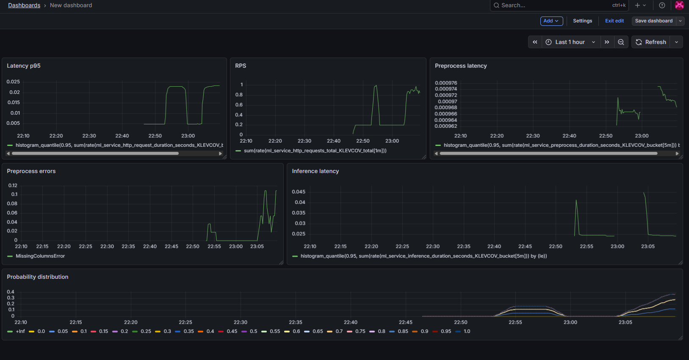

Задание 1:

    1.1 - Не хватает логирования, если что-то где-то упадёт, непонятно из-за чего и где
    1.2 - Падает с отдельной ошибкой при отсутсвии необходимых данных
          (То что не будет падать при лишних данных, так видимо и задумано, например, если новые фичи появятся)
    1.3 - Должно падать с отдельной ошибкой при отсутствии run_id переданного
     
Задание 2:

      Тесты:
       - test_to_dataframe_success - тест, который проверяет работу функции to_dataframe при корректном входе
       - test_to_dataframe_missing_columns - тест, который проверяет работу функции to_dataframe при отсутствии обязательных - колонок
       - test_to_dataframe_alias_columns - тест, который проверяет корректность работы функции to_dataframe при замене в названии колокни '_' на '.' 
       - test_predict_success - тест, который проверяет работу хэндлера /predict при успешном инференсе модели
       - test_predict_missing_columns - тест, который проверяет работу хэндлера /predict при невалидном запросе
       - test_predict_model_not_loaded - тест, который проверяет работу хэндлера /predict, если модель не загружена
       - test_health - тест, который проверяет работу хэндлера /health
       - test_update_model - тест, который проверяет работу хэндлера /updateModel
       - test_full_flow - тест, который проверяет работу сервиса целиком

Задание 3,4:
      Технические метрики сервиса:
            число запросов - HTTP_REQUESTS_TOTAL
            время ответа - HTTP_REQUEST_DURATION_SECONDS
            ошибки/исключения - HTTP_REQUEST_EXCEPTIONS_TOTAL
            коды ответов - есть через label status_code
      Метрики входных данных - покрыты:
            время предобработки - PREPROCESS_DURATION_SECONDS
            пропущенные фичи - MISSING_FEATURES_TOTAL
            статистика по значениям фичей - FEATURE_NUMERIC_VALUE, FEATURE_CATEGORICAL_VALUE_TOTAL
      Метрики модели - покрыты:
            время инференса - INFERENCE_DURATION_SECONDS
            ошибки инференса - INFERENCE_ERRORS_TOTAL
            вероятности - PREDICTION_PROBABILITY
            предсказания - PREDICTIONS_TOTAL
      Мониторинг обновления модели - покрыт:
            обновления - MODEL_UPDATES_TOTAL
            ошибки обновления - MODEL_UPDATE_ERRORS_TOTAL
            тип модели - CURRENT_MODEL_INFO
            нужные фичи - CURRENT_MODEL_REQUIRED_FEATURE
      Разбивка по перцентилям происходит в графане
      в самой графане построил метрики:

      1. Latency p95
            Показывает 95-й перцентиль времени ответа HTTP.
            Нужен для контроля задержек и выявления деградации сервиса.

      2. RPS (Requests Per Second)
            Количество запросов в секунду.
            Нужен для оценки нагрузки на сервис.

      3. Preprocess latency
            Время предобработки входных данных (p95).
            Нужно для контроля скорости подготовки данных перед моделью.

      4. Preprocess errors
            Количество ошибок на этапе предобработки (например, MissingColumnsError).
            Нужно для отслеживания проблем с входными данными.

      5. Inference latency
            Время инференса модели (p95).
            Нужно для контроля производительности модели.

      6. Probability distribution
            Распределение вероятностей предсказаний модели.
            Нужно для мониторинга поведения модели (сдвиги, аномалии, деградация).

(надеюсь вставилось, визуализация с графаны)

